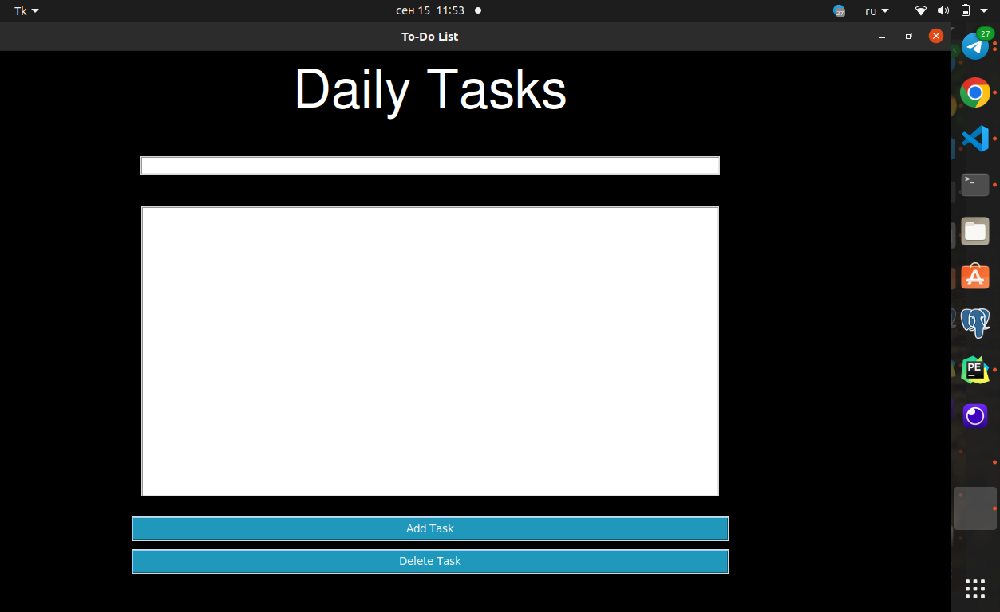

# Daily Tasks Manager

**ДЛЯ ЗАПУСКА ДЕСКТОПНОГО ПРИЛОЖЕНИЯ**

Если вы хотите проверить приложение, то скачайте весь файл и откройте "dist" -> "test" -> сама запуститься и можете проверить

Если вы хотите запустить приложение, скачайте весь репозиторий, а затем откройте файл `test.py`. Это позволит вам использовать Daily Tasks Manager локально на своем компьютере.

Daily Tasks Manager - это простое десктопное приложение, созданное с использованием PyQt5, которое позволяет вам удобно управлять вашими задачами на каждый день. Вы можете легко добавлять новые задачи с помощью кнопки "Add" и удалять их, выбрав нужную задачу и нажав кнопку "Delete".

## Основные функции

- **Добавление задачи**:
  - Введите название задачи в поле ввода в верхней части приложения.
  - Нажмите кнопку "Add", чтобы добавить задачу в список.

- **Удаление задачи**:
  - Выберите задачу из списка.
  - Нажмите кнопку "Delete", чтобы удалить выбранную задачу.

## Использование базы данных

Приложение использует SQLite для хранения задач. Ваши задачи сохраняются в базе данных, что позволяет вам сохранять свои данные между сеансами использования приложения.

## Зависимости

Для создания этого приложения использовались следующие библиотеки:

- PyQt5==5.15.2
- PyQt5-sip==12.12.2

## Запуск приложения

1. Убедитесь, что у вас установлены необходимые зависимости (PyQt5).
2. Запустите приложение, выполните `python your_app.py` в вашем терминале.

Наслаждайтесь управлением своими задачами с Daily Tasks Manager!

